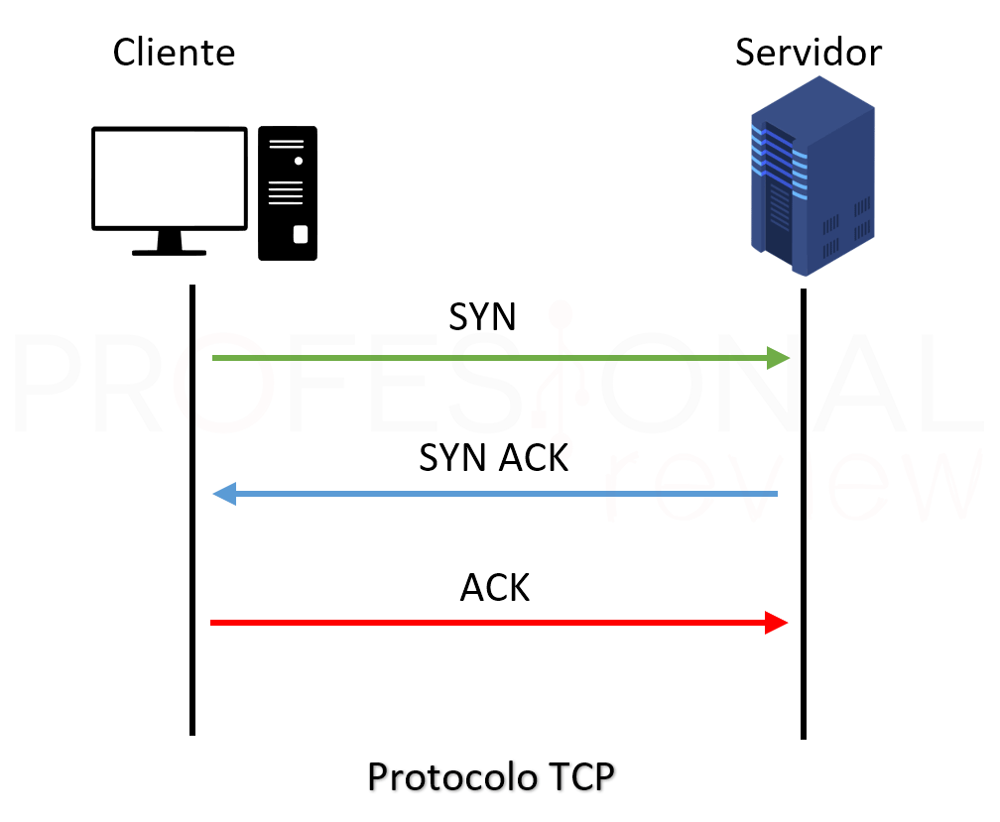

Application Description:

The real-time web chat application is a messaging platform that allows users to communicate instantly with other connected users. 
Developed using modern technologies like Spring Boot and WebSocket, this application provides a seamless and responsive chat experience.

Technologies Used:

  Spring Boot: Java application development framework that simplifies the creation of web applications by using configuration conventions and project structure.

  WebSocket: Bidirectional communication protocol that allows real-time communication between clients and servers over a TCP connection.

  HTML/CSS/JavaScript: Standard web technologies used to develop the application's user interface.
  

